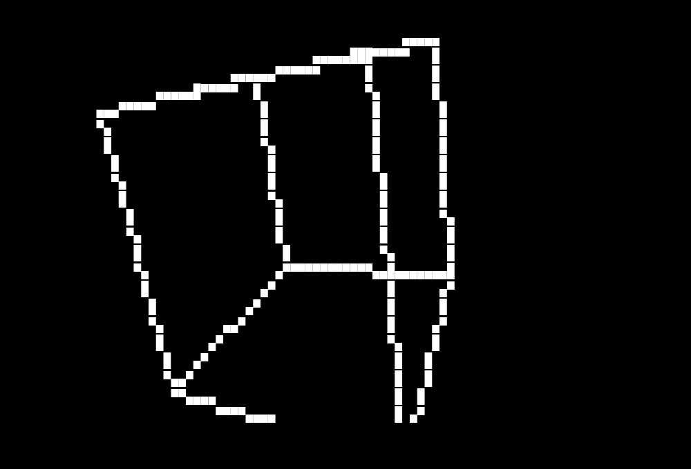

# gometry

A spinning 3D wireframe cube in your terminal. It is written in Go and drawn
with text characters — no graphics window needed.



## How to run it

```sh
go run .
```

You need Go installed. That is all.

## Controls

- **Mouse wheel up**: zoom in
- **Mouse wheel down**: zoom out
- **Esc** or **Ctrl+C**: quit

## How it works

A terminal screen is made of little boxes (cells). The program draws the 12
edges of a cube on these boxes, frame by frame, while the cube slowly spins.

Three simple ideas make this work:

1. **Bresenham's line algorithm** (`shapes/line.go`). A line between two
   points almost never lands exactly on screen boxes, so the algorithm walks
   along the line one step at a time and picks which boxes to paint. It uses
   only whole numbers, so it is fast.
2. **Half-block characters** (`▀`, `▄`, `█`). Each terminal box can hold two
   picture points stacked on top of each other. The program checks what is
   already in a box before drawing: one point paints a half block, and a
   second point in the same box completes it to a full block. This makes
   lines look smooth instead of chunky.
3. **Perspective projection** (`shapes/vec3.go`). Each 3D corner of the cube
   is mapped to the flat screen with a simple divide: farther points land
   closer to the middle, which is what gives the feeling of depth.

## Libraries used

- **[tcell](https://github.com/gdamore/tcell)** (`github.com/gdamore/tcell/v3`):
  the only outside library. It opens the terminal screen, paints
  characters with color, and reads keyboard and mouse input.

Everything else (`shapes`, `animations`) is code written for this project.

## Tests

```sh
go test ./...
```

The line algorithm, the cube math, the animations, and the zoom logic all
have tests.

## Built with

This project was developed with the help of
[OpenCode](https://opencode.ai), an AI coding assistant.
